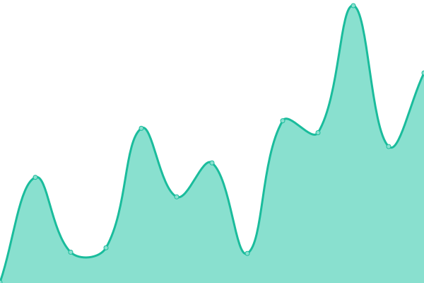
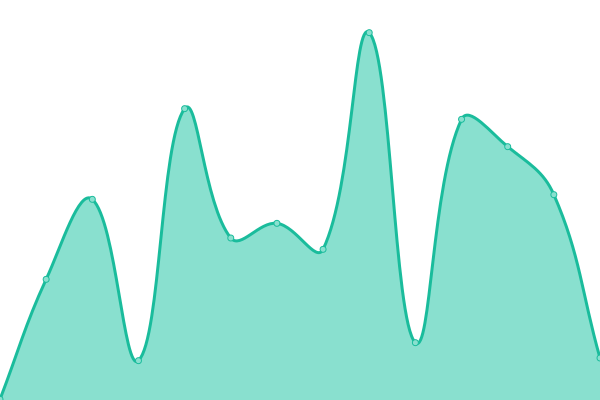
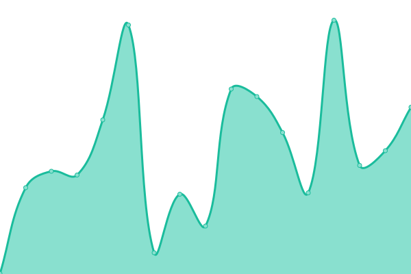
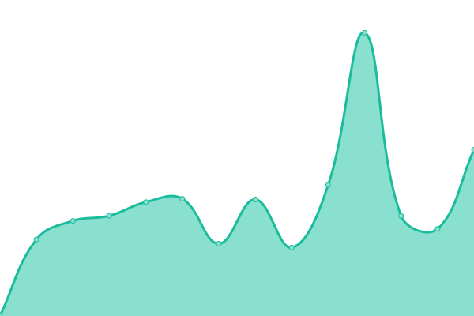
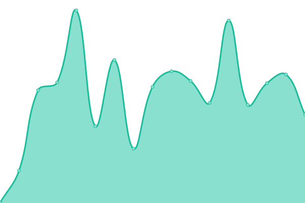

# [📈 Live Status](https://status.zoner.work): <!--live status--> **🟩 All systems operational**

This repository contains the open-source uptime monitor and status page for [Upptime](https://upptime.js.org), powered by [Upptime](https://github.com/upptime/upptime).

With [Upptime](https://upptime.js.org), you can get your own unlimited and free uptime monitor and status page, powered entirely by a GitHub repository. We use [Issues](https://github.com/upptime/upptime/issues) as incident reports, [Actions](https://github.com/fencore/zoner-upptime/actions) as uptime monitors, and [Pages](https://status.zoner.work) for the status page.

<!--start: status pages-->
<!-- This summary is generated by Upptime (https://github.com/upptime/upptime) -->
<!-- Do not edit this manually, your changes will be overwritten -->
<!-- prettier-ignore -->
| URL | Status | History | Response Time | Uptime |
| --- | ------ | ------- | ------------- | ------ |
|  [Freeport 11 - zoner.work](https://zoner.work) | 🟩 Up | [freeport-11-zoner-work.yml](https://github.com/fencore/zoner-upptime/commits/HEAD/history/freeport-11-zoner-work.yml) | 

 201ms
     
 | 

<a href="https://status.zoner.work/history/freeport-11-zoner-work">100.00%</a>
    

|  [S3 Object Storage](https://zoner.objects-us-east-1.dream.io/firefish/3441b9cc-2b08-476b-a1ff-d4e1d9abb3d2.png) | 🟩 Up | [s3-object-storage.yml](https://github.com/fencore/zoner-upptime/commits/HEAD/history/s3-object-storage.yml) | 

 288ms
     
 | 

<a href="https://status.zoner.work/history/s3-object-storage">100.00%</a>
    

|  [Garbage Collector - wf.zoner.work](https://wf.zoner.work) | 🟩 Up | [garbage-collector-wf-zoner-work.yml](https://github.com/fencore/zoner-upptime/commits/HEAD/history/garbage-collector-wf-zoner-work.yml) | 

 180ms
     
 | 

<a href="https://status.zoner.work/history/garbage-collector-wf-zoner-work">100.00%</a>
    

|  [Garbage Engine - zoner.gay](https://zoner.gay) | 🟩 Up | [garbage-engine-zoner-gay.yml](https://github.com/fencore/zoner-upptime/commits/HEAD/history/garbage-engine-zoner-gay.yml) | 

 276ms
     
 | 

<a href="https://status.zoner.work/history/garbage-engine-zoner-gay">100.00%</a>
    

|  [Garbage Cloud - nc.zoner.gay](https://nc.zoner.gay) | 🟩 Up | [garbage-cloud-nc-zoner-gay.yml](https://github.com/fencore/zoner-upptime/commits/HEAD/history/garbage-cloud-nc-zoner-gay.yml) | 

 492ms
     
 | 

<a href="https://status.zoner.work/history/garbage-cloud-nc-zoner-gay">100.00%</a>
    

|  [Trash TV - oc.zoner.gay](https://oc.zoner.gay) | 🟩 Up | [trash-tv-oc-zoner-gay.yml](https://github.com/fencore/zoner-upptime/commits/HEAD/history/trash-tv-oc-zoner-gay.yml) | 

 391ms
     
 | 

<a href="https://status.zoner.work/history/trash-tv-oc-zoner-gay">100.00%</a>
    

<!--end: status pages-->

[**Visit our status website →**](https://status.zoner.work)

## 📄 License

- Powered by: [Upptime](https://github.com/upptime/upptime)
- Code: [MIT](./LICENSE) © [Upptime](https://upptime.js.org)
- Data in the `./history` directory: [Open Database License](https://opendatacommons.org/licenses/odbl/1-0/)
